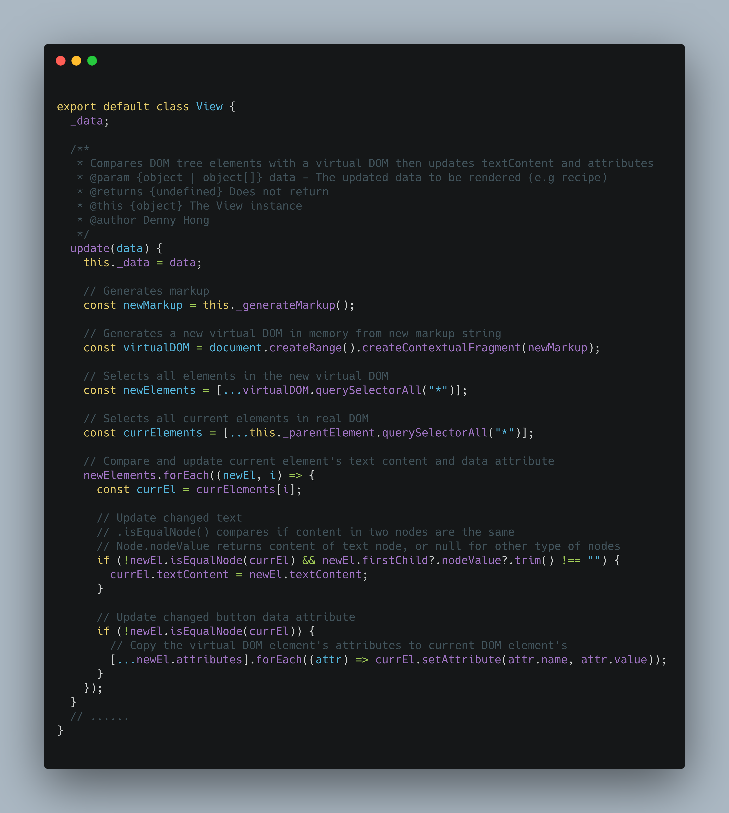

#### An example of using vanilla JS to implement MVC Architecture

##### Model, View, and controller for rendering "Recipe" userflow:

##### Custom DOM updating algorithm to avoid heavy DOM tree replacement:

##### Complete flow chart

